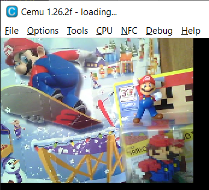

# camtest
A simple example to test the Wii U webcam.

AFAIK this is the first open source Wii U webcam example ever! :D

Download [camtest-0.1.zip](https://github.com/revvv/wut/releases/download/0.1/camtest-0.1.zip)

# Raw image format
The webcam uses the NV12 format.



If you'd like to investigate the raw format of the above image: [raw image](samples/make/camtest/selfie-mario.nv12)

**NOTE**: Cemu does not support a webcam. (I just copied a raw image from my Wii U into Cemu's SD folder.)

### Compile
Get latest devkitpro.

```
$ cd samples/make/camtest
$ make
```

# Credits
I imported and adapted [camera.h](https://github.com/revvv/wut/blob/camtest/include/camera/camera.h) from [libcafe](https://github.com/xhp-creations/libcafe/blob/master/include/wiiu/dynlib/camera.h)

Thanks @xhp-creations
